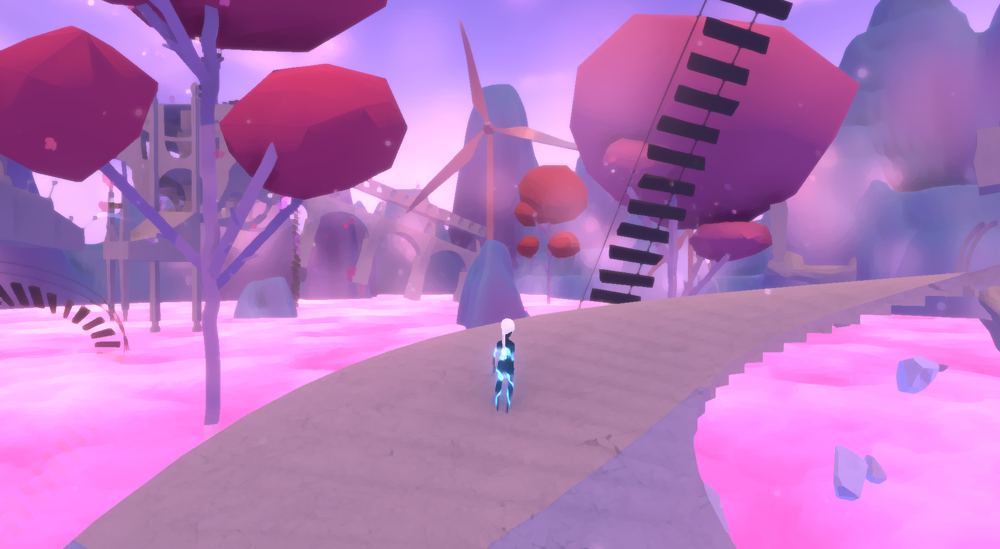
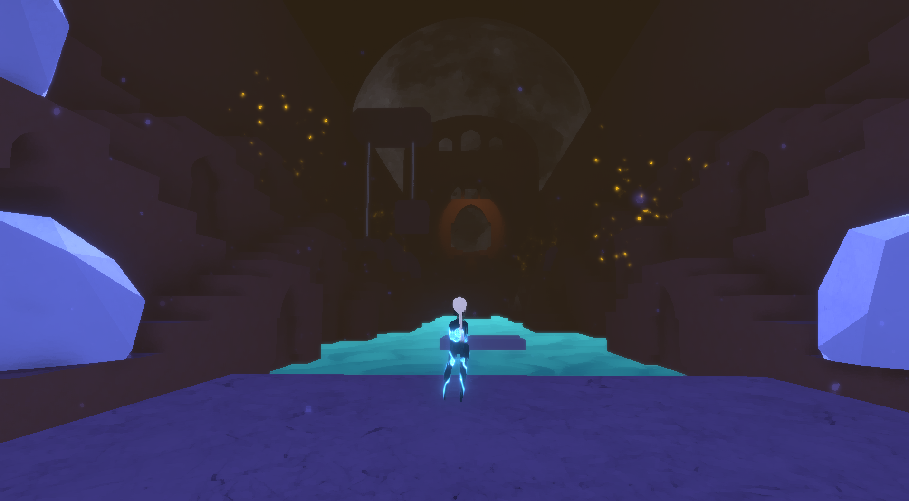
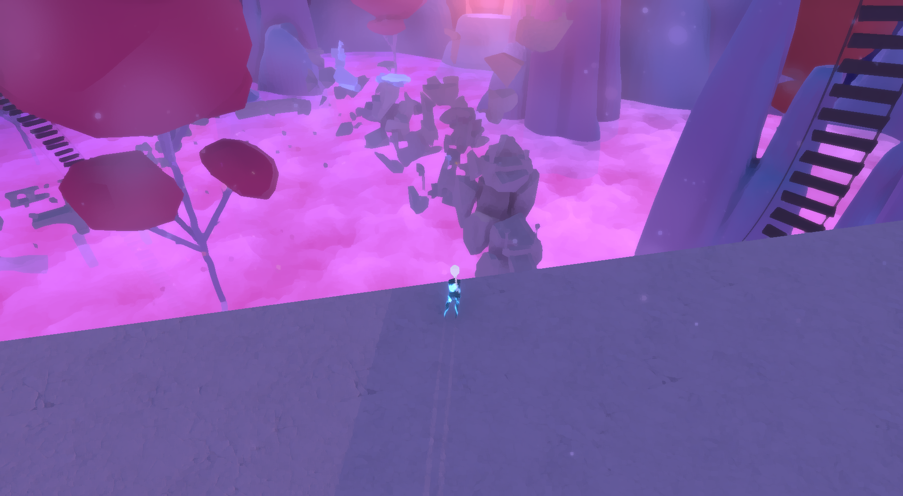

# Aurore Review

*Aurore* is an independent Adventure/Puzzle game by Reverie Forge. using environmental storytelling, it immerses the player in their adventure, similar to *Journey* and *ABZU*.  

## Gameplay
*Aurore's* gimmick is unlike anything I have played before; using the mouse buttons, the player must increase or decrease the size of the objects around them to create a path. Any resizable objects are highlighted when the camera hovers over them, which the game teacher the player early on. However, this does not just apply to the objects in front of a player, but the objects behind them as well; after traversing each structure, the structures will crumble behind them, but they are no different from when they were assembled, the only difference being that they are broken into pieces. Players brave enough to navigate broken structures may be rewarded with "memories", collectibles obtained within the game.

## Aesthetic
The game embraces the idea behind secondary worlds. This isn't prevalent at first, but after revisiting the game, I put the pieces together; The title screen is designed after a train car, but after starting the game, the player is transported to a world of pink clouds, structures floating in midair, trees without roots, and arches made from train tracks, with no train in sight. Accompanied by a gentle piano piece, it provides a relaxing ambiance.

The second half of the game changes the ambiance. Going from islands in the sky to caves with intricate stones and rivers, with a more foreboding track playing and less objects that can be manipulated. The path does not crumble behind the player, but the environment is closed in with less freedom to explore. I have a feeling that the rule of symbolism is in place, but I can't explain why.

 

## Controls
*Aurore's* concept and aesthetic serve it well, but its controls are where it falls short. The game follows the traditional WASD control scheme in addition to the space bar and mouse, but the mouse also controls the camera. Its sensitivity can be adjusted in the game's settings, but I did not notice any changes after making the adjustments. 

The game is designed as if it was meant to support an Xbox controller. The player could use the left analog stick to move, the A or B buttons to jump, control the camera with the right analog stick, and use the triggers to resize objects in their path. It would resolve the camera issue, and provide an alternative for players who are not fond of keyboard controls.

## Performance
*Aurore's* other weak point is its framerate. The game has few glitches, but it requires a lot of RAM in order to run properly. I have eight gigabytes of RAM on my computer, which can run games such as *Ori and the Will of the Wisps* without any problems, but *Aurore* struggled to keep a consistent framerate. I can't confirm if it is my computer that is causing the problem, or if a different source such as the game's engine or rendering a large number of assets simultaneously that lowers the framerate, but it kept me from being completely immersed in the game. 

**[Back to Main >>>](https://arrowarchive.github.io/The-Arrowarchive/index)**
