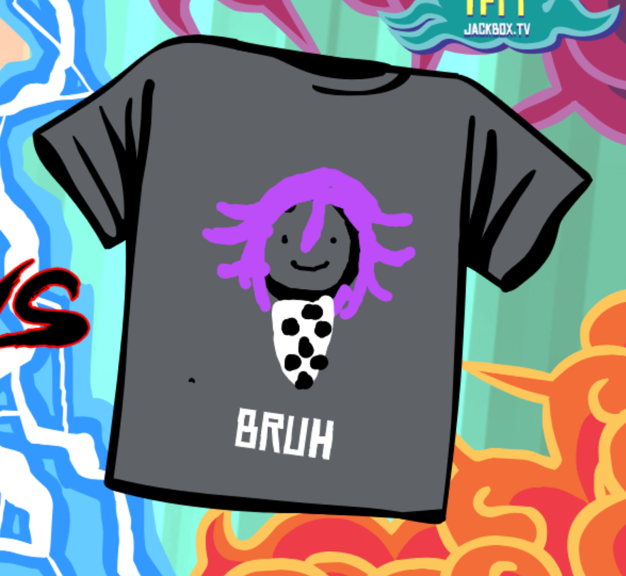
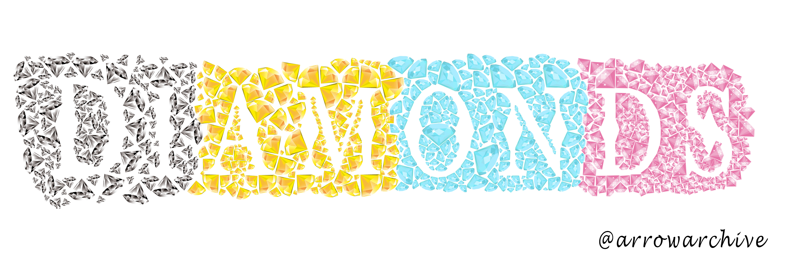
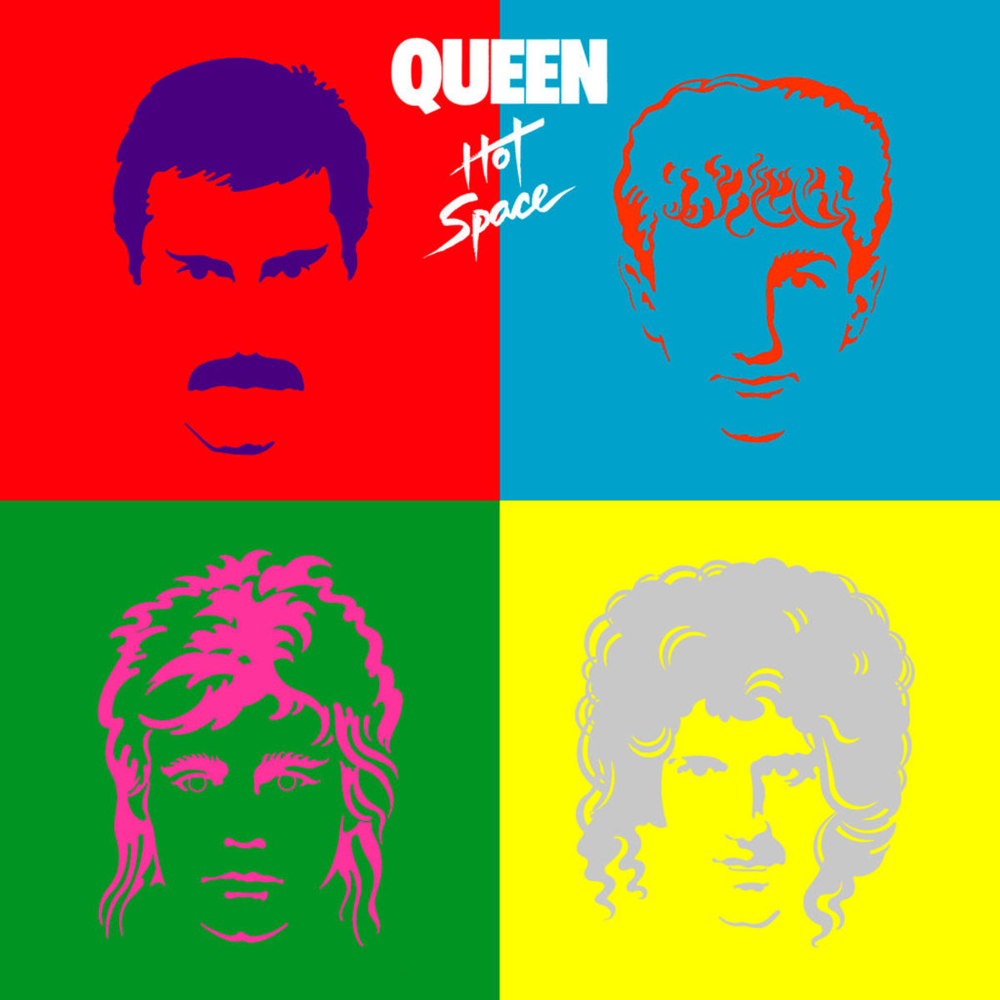
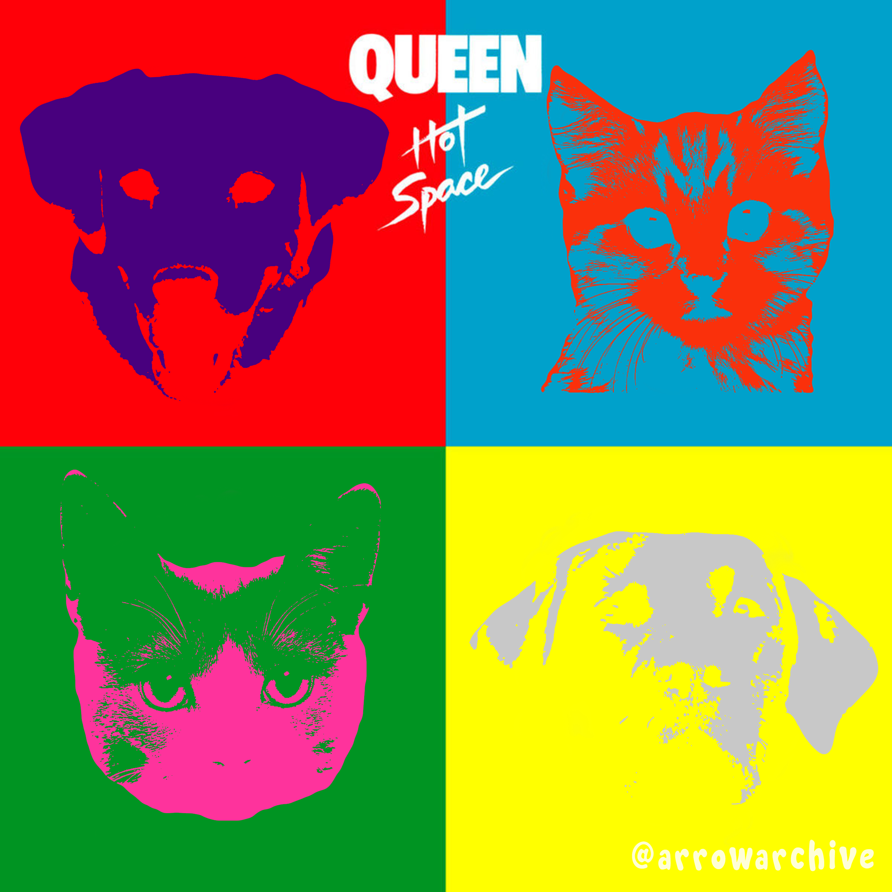
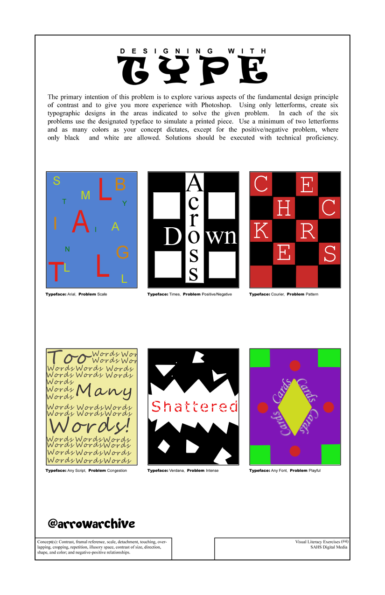
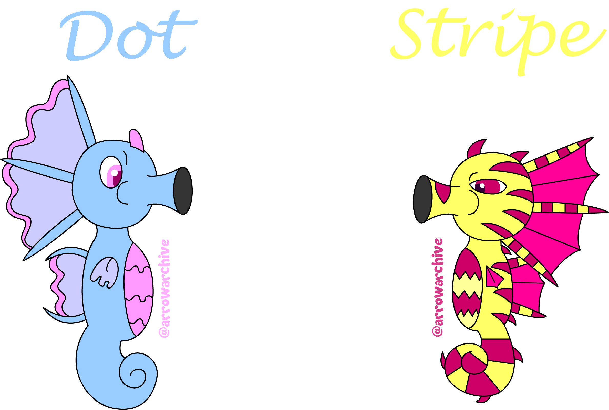

### NOTE: I plan to update this page so the thumbnail of each image will be visible, and clicking on the thumbnail will redirect to a tab for the full image. This is a goal of mine for this Repo.

* This is an image upload test on my repo. This is a doodle of a character from the *Danganronpa* series that I drew in a round of *Tee-KO*. 

* I had to do a negative space project for my Digital Media/Design Class in my third year of high school. I installed a custom font and I used multicolored diamonds to show the outline of the word within the empty space (bonus points if you know why I chose the diamond colors) 

* Another project from my Digital Media/Design class was to recreate an album cover using pictures of animals. For this project, I chose to recreate *Queen's* album "Hot Space", using cats and dogs. Here is a comparison of the original cover (top) and my recreation (bottom)  

* My first assignment for my Digital Media/Design class was to design six text graphics. This assignment taught me that *Clip Studio Paint* and *Adobe Photoshop* are compatible programs, and I spent the next several weeks comparing and contrasting the programs to learn more about them 

* About two years ago, I designed some seahorses and I wanted to see how they looked digitally. I took to *Adobe Illustrator* (My art program at the time) and started working on their designs. I am proud of the designs and colors I used for them, but I need to redraw them someday 
