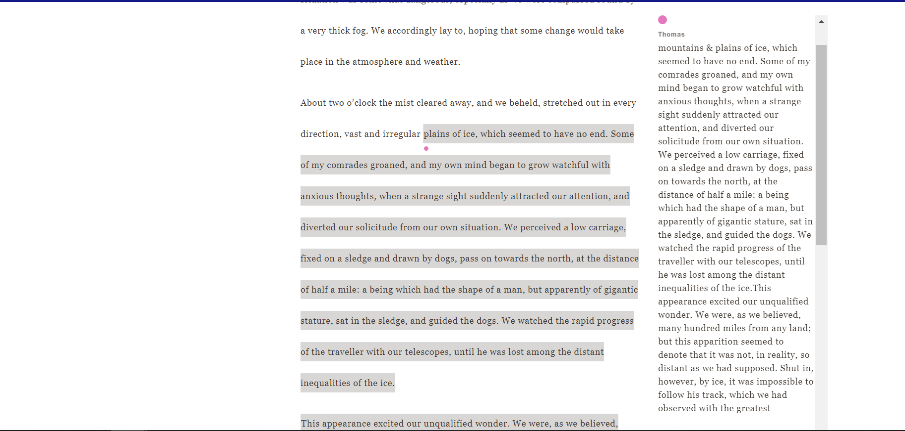

# *Frankenstein* Variorum Reflection

I didn't know about Variorum Viewer and the Shelley-Godwin Archive until recently, and for my latest project, I read five drafts of *Frankenstein* archived within it.

The website contains the manuscript, 1818 edition, 1823 edition, Thomas edition, and 1831 editions. Before I begin, it's worth noting that the manuscript is not finished. Section 7 onwards has been published, but the previous sections have not been translated as of the time of writing this. Without further adieu, let's begin:

As I read through *Frankenstein*, I noticed several differences within the Thomas edition. This is a given, considering the history behind it, but there are numerous instances where this version is lengthier than the others. An example of this (pictured below) is from the 1818 edition, section 5. The scene describing the mountains and plains is written in greater detail, but the sentences run on. 

Similar to the Thomas edition, the 1831 edition makes several changes. The 1831 makes numerous changes in spelling, grammar, and punctuation, smaller changes than the Thomas version, with some inconsistencies. The 1831 edition is revised to include the modern spelling of several words, with some exceptions; section 3 of the 1818 edition includes the modern spelling of sympathize (pictured below), while it is spelled differently in every other version. 

Before concluding my reflection, I want to provide a critique of the Variorum Viewer. The website runs well and I haven't had issues with the pages failing to load or crashing, but I've had issues with what I call "The black bar". I'm not sure if this is exclusive to my operating system (Windows), but when I am reading through a comparison that takes up a lot of space, the text will wrap to fit the box. Unfortunately, this results in the last line of text being cut, with the characters being hard to read. I've tried zooming out on the web page, which fixes the problem slightly, but it is something that I hope can be fixed. 
